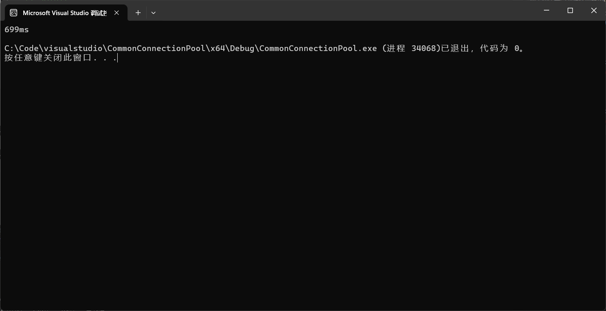

手写数据库连接池

## 1、准备工作（环境搭建）

MySQL的windows安装文件云盘地址如下（development开发版，mysql头文件和libmysql库文件）： 链接：https://pan.baidu.com/s/1Y1l7qvpdR2clW5OCdOTwrQ 

提取码：95de

安装后通过cmd进入数据库，创建chat数据库，并在chat中创建user表 


## 2、代码接口测试（不带连接池，单线程）

在main.cpp文件中加入以下代码测试数据库连接接口：

```c++
Connection conn;
char sql[1024] = { 0 };
sprintf(sql, "insert into user(name,age,sex) values('%s',%d,'%s')",
	"zhang san", 20, "male");
conn.connect("127.0.0.1", 3306, "root", "123456", "chat");
conn.update(sql);

```

接口测试完毕：


## 3、源码解析

### 1、连接池CommonConnectionPool使用线程安全的懒汉单例模式

关于懒汉单例模式：[c++手撕代码（五）设计模式：线程安全懒汉单例 - 知乎 (zhihu.com)](https://zhuanlan.zhihu.com/p/540185643)

**单例类在整个程序中第一次用到的时候才实例化，不用不实例化**，这种模式就是懒汉模式。

为了使全部线程只实现一个pool，得保证线程的安全。

```c++
class ConnectionPool
{
public:
	// 获取连接池对象实例
	static ConnectionPool* getConnectionPool()
    {
        static ConnectionPool pool; //声明一个静态局部变量实现懒汉模式，只有第一次调用getConnectionPool的时候才会初始化pool，且全局只会初始化一次
        return &pool;
    }
private:
	// 单例#1 构造函数私有化,这样使用户无法自己创建对象。
	ConnectionPool();
}
```

### 2、加载连接池性能参数配置

在mysql.ini文件中定义了连接池的性能参数，windows下后缀为.ini，Linux下后缀为.cnf

```c++
#数据库连接池的配置文件
ip=127.0.0.1
port=3306
username=root
password=123456
dbname=chat
initSize=10
maxSize=1024
#最大空闲时间默认单位是秒
maxIdleTime=60
#连接超时时间单位是毫秒
connectionTimeOut=100
```

bool ConnectionPool::loadConfigFile()函数实现加载配置文件

构造连接池：

```c++
ConnectionPool::ConnectionPool()
{
	// 加载配置项
	if (!loadConfigFile())
	{
		return;
	}

	// 创建初始数量的连接
	for (int i = 0; i < _initSize; ++i)
	{
		Connection *p = new Connection();
		p->connect(_ip, _port, _username, _password, _dbname);
		p->refreshAliveTime(); // 刷新一下开始空闲的起始时间
		_connectionQue.push(p);
		_connectionCnt++;
	}
```

### 3、创建连接的生产者

关于智能指针：[[C/C++面试：什么是智能指针？智能指针有什么作用？分为哪几种？各自有什么样的特点？_什么是智能指针?智能指针有什么作用?分为哪几种?各自有什么样的特点?-CSDN博客](https://blog.csdn.net/zhizhengguan/article/details/112302192)](https://zhuanlan.zhihu.com/p/150555165)

使用智能指针shared_ptr管理连接的释放

**创建生产者线程：**

**关于绑定器：**[第六节 std::bind 绑定器 - 知乎 (zhihu.com)](https://zhuanlan.zhihu.com/p/354765449)

```c++
thread produce(std::bind(&ConnectionPool::produceConnectionTask, this));//绑定器给成员方法绑定一个当前对象
produce.detach();
```

```c++
// 运行在独立的线程中，专门负责生产新连接
void ConnectionPool::produceConnectionTask()
{
	for (;;)
	{
		unique_lock<mutex> lock(_queueMutex); //上锁
		while (!_connectionQue.empty())
		{
			cv.wait(lock); // 队列不空，此处生产线程进入等待状态 解锁
		}

		// 连接数量没有到达上限，继续创建新的连接
		if (_connectionCnt < _maxSize)
		{
			Connection *p = new Connection();
			p->connect(_ip, _port, _username, _password, _dbname);
			p->refreshAliveTime(); // 刷新一下开始空闲的起始时间
			_connectionQue.push(p);
			_connectionCnt++;
		}

		// 通知消费者线程，可以消费连接了
		cv.notify_all();
	}
}
```

### 4、消费连接的消费者

#### 1、关于unique_lock:[C++11多线程编程(三)——lock_guard和unique_lock - 知乎 (zhihu.com)](https://zhuanlan.zhihu.com/p/340348726)

#### 2、关于cv.wait_for：[C++11（六） 条件变量（condition_variable） - 知乎 (zhihu.com)](https://zhuanlan.zhihu.com/p/224054283)

```c++
// 给外部提供接口，从连接池中获取一个可用的空闲连接
shared_ptr<Connection> ConnectionPool::getConnection()
{
	unique_lock<mutex> lock(_queueMutex);
	while (_connectionQue.empty())
	{
		// sleep
		if (cv_status::timeout == cv.wait_for(lock, chrono::milliseconds(_connectionTimeout)))//给毫秒时间
		{
			if (_connectionQue.empty())
			{
				LOG("获取空闲连接超时了...获取连接失败!");
					return nullptr;
			}
		}
	}

	/*
	shared_ptr智能指针析构时，会把connection资源直接delete掉，相当于
	调用connection的析构函数，connection就被close掉了。
	这里需要自定义shared_ptr的释放资源的方式，把connection直接归还到queue当中
	*/
	shared_ptr<Connection> sp(_connectionQue.front(), 
		[&](Connection *pcon) {
		// 这里是在服务器应用线程中调用的，所以一定要考虑队列的线程安全操作
		unique_lock<mutex> lock(_queueMutex);
		pcon->refreshAliveTime(); // 刷新一下开始空闲的起始时间
		_connectionQue.push(pcon);
	});

	_connectionQue.pop();
	cv.notify_all();  // 消费完连接以后，通知生产者线程检查一下，如果队列为空了，赶紧生产连接
	
	return sp;
}
```

### 5、最大空闲时间回收连接

```c++
	//Connection.h:
	void refreshAliveTime() { _alivetime = clock(); }
	// 返回存活的时间
	clock_t getAliveeTime()const { return clock() - _alivetime; }
private:
	MYSQL *_conn; // 表示和MySQL Server的一条连接
	clock_t _alivetime; // 记录进入空闲状态后的起始存活时间
```

在进入队列时，都要刷新空闲时间

```C++
void ConnectionPool::scannerConnectionTask()
{
	for (;;)
	{
		// 通过sleep模拟定时效果
		this_thread::sleep_for(chrono::seconds(_maxIdleTime));

		// 扫描整个队列，释放多余的连接
		unique_lock<mutex> lock(_queueMutex);
		while (_connectionCnt > _initSize)
		{
			Connection *p = _connectionQue.front();
			if (p->getAliveeTime() >= (_maxIdleTime * 1000))
			{
				_connectionQue.pop();
				_connectionCnt--;
				delete p; // 调用~Connection()释放连接
			}
			else
			{
				break; // 队头的连接没有超过_maxIdleTime，其它连接肯定没有
			}
		}
	}
}
```

### 6、压力测试

| 数据量 | 未使用连接池花费的时间             | 使用连接池花费时间              |
| ------ | ---------------------------------- | ------------------------------- |
| 1000   | 单线程：1413ms      四线程：488ms  | 单线程：699ms     四线程：323ms |
| 5000   | 单线程：6901ms      四线程：2168ms | 单线程：3362ms   四线程：1385ms |
| 10000  | 单线程：12724ms    四线程：4061ms  | 单线程：6092ms   四线程：2686ms |

#### 进入MySQL进行模拟


#### 插入1000、5000、10000组数据

#### （1）普通单线程模拟

```c++
int main()
{
	clock_t begin = clock();
    for (int i = 0; i < 10000; ++i) //是有1000个用户使用，而不是一个用户使用1000次，对于每一个请求都重新访问数据库
    {
        Connection conn;
        char sql[1024] = { 0 };
        sprintf(sql, "insert into user(name,age,sex) values('%s',%d,'%s')",
            "zhang san", 20, "male");
        conn.connect("127.0.0.1", 3306, "root", "123456", "chat");
        conn.update(sql);
    }
    clock_t end = clock();
    cout << (end - begin) << "ms" << endl;
    return 0;
}
```


#### （2）连接池单线程

```c++
int main()
{
	clock_t begin = clock();
    ConnectionPool* cp = ConnectionPool::getConnectionPool();
    for (int i = 0; i < 10000; ++i) //是有1000个用户使用，而不是一个用户使用1000次，对于每一个请求都重新访问数据库
    {
        

        shared_ptr<Connection> sp = cp->getConnection();
        char sql[1024] = { 0 };
        sprintf(sql, "insert into user(name,age,sex) values('%s',%d,'%s')",
            "zhang san", 22, "male");
        sp->update(sql);


    }
    clock_t end = clock();
    cout << (end - begin) << "ms" << endl;
    }
```



#### （3）普通四线程模拟

```c++
int main()
{
	
	Connection conn;//初始登录建立连接
	conn.connect("127.0.0.1", 3306, "root", "123456", "chat");

	clock_t begin = clock();
	
	thread t1([]() {
		/*ConnectionPool* cp = ConnectionPool::getConnectionPool();*/
		for (int i = 0; i < 2500; ++i)
		{
			Connection conn;
			char sql[1024] = { 0 };
			sprintf(sql, "insert into user(name,age,sex) values('%s',%d,'%s')",
				"zhang san", 20, "male");
			conn.connect("127.0.0.1", 3306, "root", "123456", "chat");
			conn.update(sql);

			
		}
	});
	

	thread t2([]() {
		/*ConnectionPool* cp = ConnectionPool::getConnectionPool();*/
		for (int i = 0; i < 2500; ++i)
		{
			Connection conn;
			char sql[1024] = { 0 };
			sprintf(sql, "insert into user(name,age,sex) values('%s',%d,'%s')",
				"zhang san", 20, "male");
			conn.connect("127.0.0.1", 3306, "root", "123456", "chat");
			conn.update(sql);

		}
	});
	


	thread t3([]() {
		/*ConnectionPool* cp = ConnectionPool::getConnectionPool();*/
		for (int i = 0; i < 2500; ++i)
		{
			Connection conn;
			char sql[1024] = { 0 };
			sprintf(sql, "insert into user(name,age,sex) values('%s',%d,'%s')",
				"zhang san", 20, "male");
			conn.connect("127.0.0.1", 3306, "root", "123456", "chat");
			conn.update(sql);

		}
	});
	
	
	thread t4([]() {
		/*ConnectionPool* cp = ConnectionPool::getConnectionPool();*/
		for (int i = 0; i < 2500; ++i)
		{
			Connection conn;
			char sql[1024] = { 0 };
			sprintf(sql, "insert into user(name,age,sex) values('%s',%d,'%s')",
				"zhang san", 20, "male");
			conn.connect("127.0.0.1", 3306, "root", "123456", "chat");
			conn.update(sql);

		}
	});


	t1.join();
	t2.join();
	t3.join();
	t4.join();

	clock_t end = clock();
	cout<<(end - begin) << "ms" << endl;
    return 0;
}
```


#### （4）连接池四线程模拟

int main()
{
	/*Connection conn;
	conn.connect("127.0.0.1", 3306, "root", "123456", "chat");*/


```c++
int main()
{
    Connection conn;
	conn.connect("127.0.0.1", 3306, "root", "123456", "chat");
    
    clock_t begin = clock();

    thread t1([]() {
        ConnectionPool* cp = ConnectionPool::getConnectionPool();
        for (int i = 0; i < 250; ++i)
        {
            char sql[1024] = { 0 };
            sprintf(sql, "insert into user(name,age,sex) values('%s',%d,'%s')",
                "zhang san", 20, "male");
            shared_ptr<Connection> sp = cp->getConnection();
            sp->update(sql);

        }
    });
    thread t2([]() {
        ConnectionPool* cp = ConnectionPool::getConnectionPool();
        for (int i = 0; i < 250; ++i)
        {
            
            char sql[1024] = { 0 };
            sprintf(sql, "insert into user(name,age,sex) values('%s',%d,'%s')",
                "zhang san", 20, "male");
            shared_ptr<Connection> sp = cp->getConnection();
            sp->update(sql);

        }
    });
    thread t3([]() {
        ConnectionPool* cp = ConnectionPool::getConnectionPool();
        for (int i = 0; i < 250; ++i)
        {
            char sql[1024] = { 0 };
            sprintf(sql, "insert into user(name,age,sex) values('%s',%d,'%s')",
                "zhang san", 20, "male");
            shared_ptr<Connection> sp = cp->getConnection();
            sp->update(sql);

        }
    });
    thread t4([]() {
        ConnectionPool* cp = ConnectionPool::getConnectionPool();
        for (int i = 0; i < 250; ++i)
        {
           
            char sql[1024] = { 0 };
            sprintf(sql, "insert into user(name,age,sex) values('%s',%d,'%s')",
                "zhang san", 20, "male");
            shared_ptr<Connection> sp = cp->getConnection();
            sp->update(sql);

        }
    });
    t1.join();
    t2.join();
    t3.join();
    t4.join();

    clock_t end = clock();
    cout<<(end - begin) << "ms" << endl;
    return 0;
    
}

```


### 7、在进行测试时出现的问题

#### 使用（3）普通四线池模拟时，插入的数据没达到设定的量时就会报错：更新失败。

原因：MySQL不支持一个用户同时在多个地方进行登陆创建连接进行访问。

解决方案：在线程前先完成登录，创建连接。但是记录时间从创立了连接后开始

```c++
Connection conn;
conn.connect("127.0.0.1", 3306, "root", "123456", "chat");
clock_t begin = clock();
```


